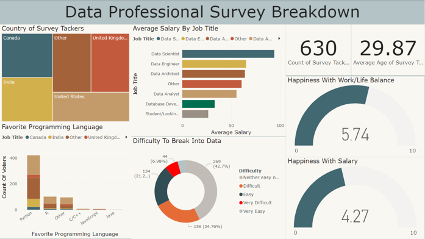

# Power BI Dashboard - Data Professional Survey Visualization

## Overview
The goal of this project is to analyze and visualize data collected from individuals regarding their location, job, salary, favorite programming language, and level of job satisfaction,... The collected data will be transformed into meaningful insights and presented in an interactive and visually appealing manner using Power BI.

## Results

||
| :--: |
| *Dashboard* |

This dashboard shows the number of survey participants, the country they live in, their average salary, their favorite programming language, and their satisfaction with their salary and workspace.

## Method

### Cleansing data

Data cleaning: Convert the data in the column Job title, Salary and Favorite Programming Language to consistent data.
There are 11 important fields here:

* Unique ID

* Which Title Best Fits your Current Role? This show 

* Q3 - Current Yearly Salary (in USD)

* Q4 - What Industry do you work in?

* Q5 - Favorite Programming Language

* Q6 - How Happy are you in your Current Position with the following? (Salary)

* Q6 - How Happy are you in your Current Position with the following? (Work/Life Balance)

* Q7 - How difficult was it for you to break into Data?

* Q11 - Which Country do you live in?

### Power BI Visualization

1. Connect to data: apply the downloaded Excel file to Power BI
2. Power Query: Convert the data mentioned above in the data section.
3. Create visualizations: Various visualizations have been created such as a tree map for the Country of Survey, a Stacked bar Chart for Average Salary by Job Title, a Stacked Column Chart for Favorite Programming Language, a Donut Chart for Difficulty Break into Data, Card for quantity and Average Age of Survey Tackers, Gauge for satisfaction with Work/Life balance and Salary.
4. Create dashboards: Charts are organized into a layout that allows users to see multiple visualizations at once and get a complete understanding of the data.

## Credits
This original project Power BI dashboard was created by Alex The Analyst. The data used in this visualization was sourced from Alex The Analyst's Github.