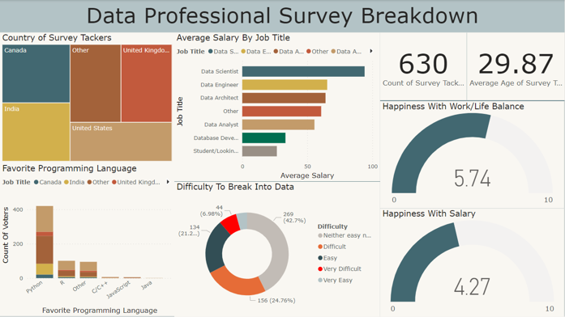

# Power BI Dashboard - Data Visualization

||
| :--: |
| *Dashboard* |

## Project Overview
The goal of these projects is to analyze and visualize data collected from different data sources. The collected data will be transformed into meaningful insights and presented in an interactive and visually appealing manner using Power BI.

## Data Preparation
Before visualizing the data in Power BI, it is important to ensure the data is properly prepared and formatted. The following steps were taken in Power BI to prepare the data for visualization:

1. Data Cleaning: The collected data were reviewed for any inconsistencies or errors and cleaned accordingly.
2. Data Transformation: If necessary, certain data fields were transformed or modified to facilitate analysis and visualization.
3. Data Integration: Additional data sources, if applicable, were integrated with the survey data to enhance the analysis.

## Power BI Visualization

1. Connect to Data: Power BI was connected to the prepared dataset containing the survey responses.
2. Data Modeling: The data model was created, defining relationships between the different data fields.
3. Visualization Creation: Various visualizations were created using Power BI's intuitive drag-and-drop interface. Common visualizations include bar charts, line charts, scatter plots, maps, and tables.
4. Interaction and Filters: Interactivity features were implemented to enable users to explore the data and filter visualizations based on different criteria.
5. Dashboard Creation: Visualizations were organized into a dashboard layout, allowing users to view multiple visualizations at once and gain a comprehensive understanding of the data.

## Projects
1. [Professional Survey Project](./Data-professional-survey/README.md)

